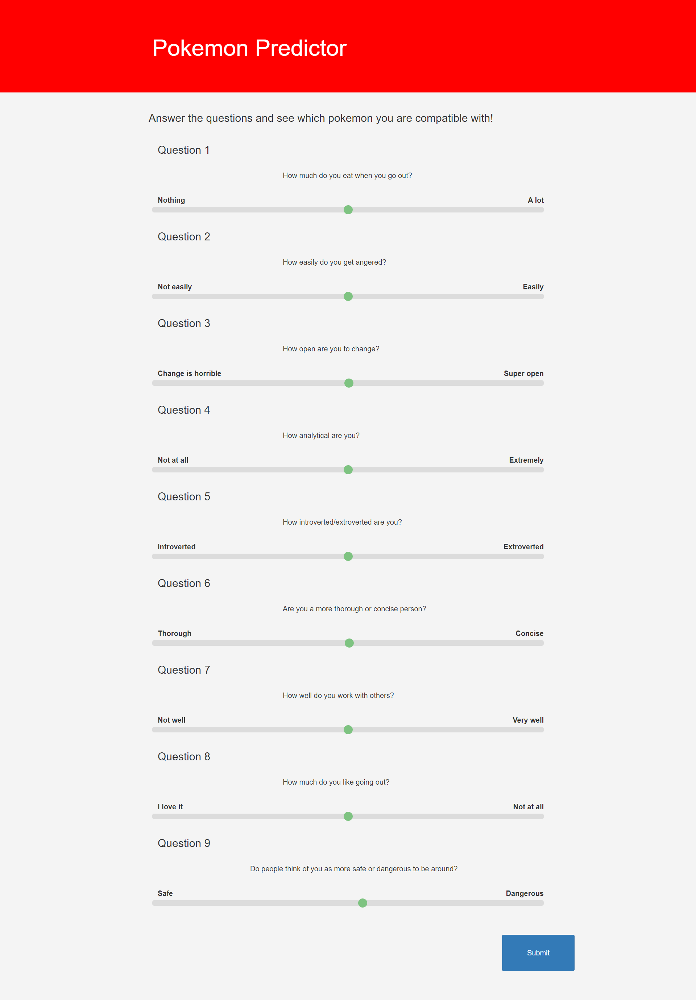
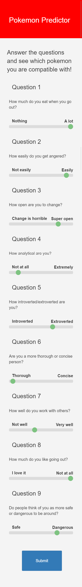

# Pokemon Compatibility Predictor Website

A fun little website where you answer a series of 9 questions that will tell you what pokemon is the most and least compatible with you. In addition to this, I also show the top 6 pokemon that are the most and least like you so that you know which pokemon to use on your team, and which pokemon to stay away from.

This website was written using the following technologies and languages: HTML, CSS, Bootstrap, Python, Django.

Adaptive design was of the utmost importance when creating the website. Here are some examples of how the website adapts to certain screen sizes:

## First page large screens:

## First page small screens:

## Second page large screens:

## Second page small screens:

