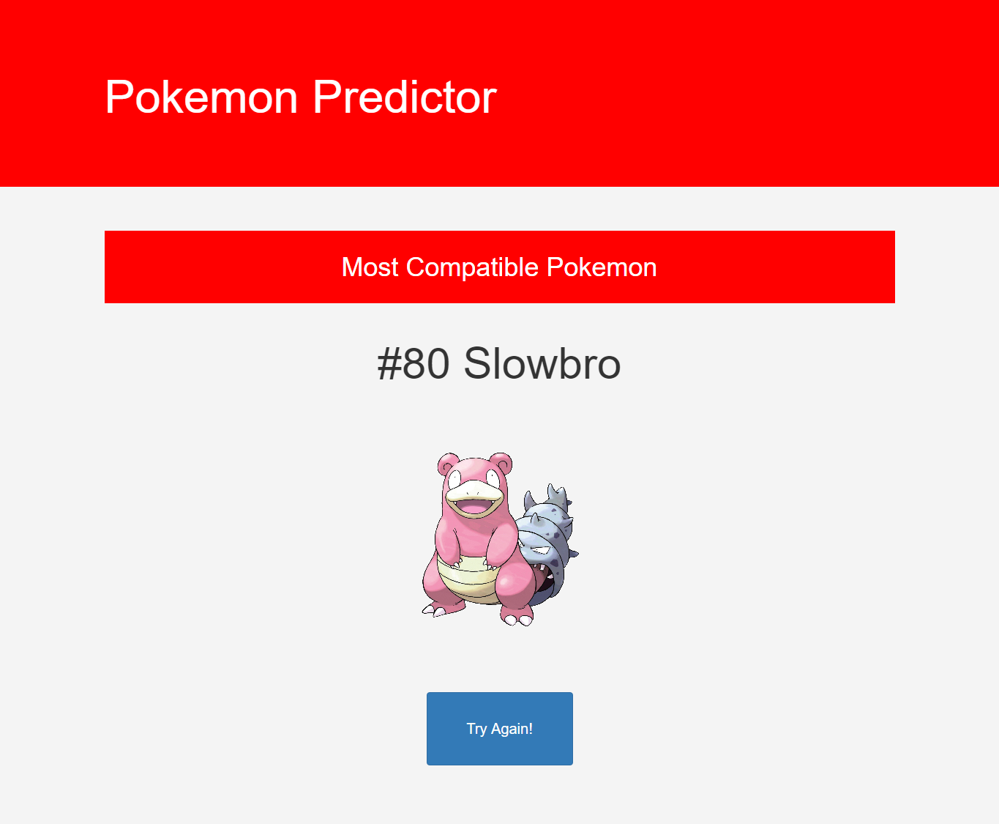

# Pokemon Compatibility Predictor

Libraries/Frameworks used: Bootstrap, Django, Scikit-learn

Technology used: Jupyter Notebook

A fun little website where you answer a series of 8 questions that will tell you what pokemon is the most compatible with you. All 721 Pokemon from generations 1-6 are possible outcomes here. Make sure you answer truthfully!

Adaptive design was of the utmost importance when creating the website. Try it out with large or small screens for interesting results!

## The Pokémon it Chose for Me 😎:

