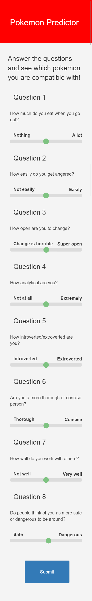
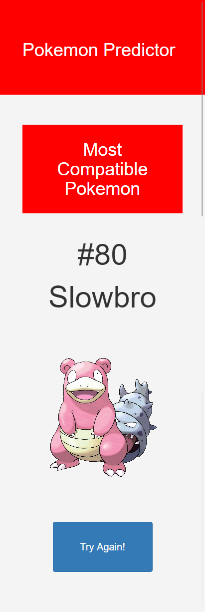

# Pokemon Compatibility Predictor Website

A fun little website where you answer a series of 8 questions that will tell you what pokemon is the most compatible with you. All 721 Pokemon from generations 1-6 are possible outcomes here. Make sure you answer truthfully!

This website was written using the following technologies and languages: HTML, CSS, Bootstrap, Python, Django and Scikit-learn.

Adaptive design was of the utmost importance when creating the website. Here are some examples of how the website adapts to certain screen sizes:

## First page large screens:

## First page small screens:

## Second page large screens:

## Second page small screens:

